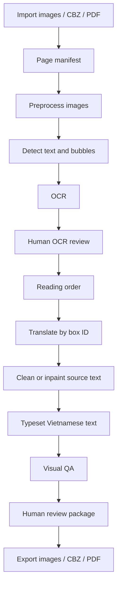

# Phase 9 Architecture

## Architecture Principle

The canonical Phase 9 object is not the final translated image. The canonical object is:

```text
page + stable box IDs + manifest + audit trail
```

Cleaned images, rendered pages, previews, CBZ files, PDF files, masks, QA reports, and human review packages are generated artifacts derived from that canonical state.

## Existing NTS Components To Reuse

Phase 9 must extend, not replace, these existing patterns:

- Workspace storage under local project directories.
- SQLite metadata with disk-backed large artifacts.
- Typer CLI command groups.
- `task_runs` and `model_runs` run tracking.
- Provider configuration validation.
- Saved GUI provider config.
- Provider preflight that redacts API keys.
- Stable prompt and hybrid prompt translation stack.
- Approved dictionary support.
- Approved memory support.
- Rule verifier-only policy.
- Artifact-backed QA reports.
- Production rollout job reports.
- Job progress polling through artifacts.
- GUI backend/frontend pattern for status and artifact viewing.
- Browser smoke checklist patterns.

## Service Boundaries

Phase 9 should be implemented as service-layer modules under `packages/nts_core/` and storage helpers under `packages/nts_storage/`, with the GUI and CLI calling those services.

Recommended services:

- `MangaProjectService`: create and load manga/image projects.
- `MangaImportService`: import folders, single images, CBZ/ZIP, and optional PDF scans.
- `MangaArtifactService`: allocate stage directories and write redacted summaries.
- `ImagePreprocessService`: create normalized images and OCR variants.
- `RegionDetectionService`: call text and bubble detection adapters.
- `OcrAdapterService`: call local or cloud OCR adapters.
- `OcrReviewService`: store corrections without overwriting prior records.
- `ReadingOrderService`: infer and edit page/box reading order.
- `MangaTranslationService`: translate by stable box ID using existing provider, dictionary, and memory stack.
- `CleaningService`: generate masks and clean text regions.
- `TypesetRenderService`: fit and render Vietnamese text.
- `MangaVisualQaService`: produce blocker reports and review packages.
- `MangaExportService`: export image folders, CBZ files, and PDF files.
- `MangaProductionRolloutService`: run canary and batch jobs with provider preflight.

## Adapter Interfaces

Detection, OCR, cleaning, inpainting, rendering, and PDF import must use adapter-style boundaries. The core should not hard-code a single paid or cloud provider.

Each adapter must report:

- Adapter ID and version.
- Local or cloud execution mode.
- Input artifact references.
- Output artifact references.
- Confidence scores when available.
- Warnings and recoverable errors.
- Whether any user image left the local machine.
- Redacted configuration snapshot.

## Pipeline



## Required Architecture Decisions

### 1. Local OCR First Versus Cloud OCR

Default OCR must be local. Manga OCR should be first for Japanese manga, PaddleOCR first for Chinese/Korean/English/mixed CJK, and EasyOCR/Tesseract fallback. Cloud OCR adapters are opt-in only and must mark artifacts with `cloud_used: true`.

### 2. Plugin-Style OCR Adapters

OCR adapters must share an interface that accepts image region crops or page images plus box metadata and returns OCR text, confidence, script/language hints, orientation hints, and raw engine output path. The raw engine output must stay local and redacted.

### 3. Plugin-Style Inpainting And Cleaning Adapters

Cleaning starts with deterministic white/color fill and OpenCV inpaint. Neural and cloud inpainting adapters remain optional and must not be required for Phase 9 core tests.

### 4. Page, Box, And Region Data Model

Every page gets a stable `page_id`. Every text/bubble/SFX/caption region gets a stable `box_id`. Translations, OCR results, corrections, masks, render decisions, QA blockers, and human review notes reference those IDs.

### 5. OCR Corrections As Dictionary And Memory Candidates

OCR corrections can produce candidates for dictionary or memory review, but they must not auto-promote. Each candidate must include source image reference, box ID, before/after text, confidence, reviewer provenance, and scope.

### 6. Translated Bubble Text Uses Existing NTS Prompt Stack

Manga translation must call the same provider routing and safe prompt stack used by text-novel production. The translation context bundle may include page context, box order, OCR text, approved dictionary entries, approved memory, and prior translated boxes. It must not include approved rules in prompts or raw NLP cache.

### 7. Vertical Text

Detection and OCR artifacts must store orientation and script direction. For vertical Japanese, OCR should prefer Manga OCR or another adapter proven on vertical text. Rendering to Vietnamese should be horizontal by default unless a user explicitly selects vertical styling.

### 8. SFX

SFX must be detected as `region_type: sfx` or marked manually. Phase 9 should not require stylized SFX redraw for PASS. SFX can be translated as margin captions, small overlays, or left unchanged with a review note depending on user settings.

### 9. Text Outside Bubbles

Text outside bubbles must be first-class regions, not discarded. Region types include `dialogue`, `caption`, `narration`, `sfx`, `sign`, `note`, and `unknown`.

### 10. Long Vietnamese Text Overflow

The renderer must fit text with wrapping, font-size stepping, line-height control, and overflow reporting. It must not silently draw outside the assigned box. Overflow can be resolved by manual text edit, smaller font, region expansion, or QA blocker.

### 11. CBZ And PDF Export

CBZ export should use Python `zipfile` and deterministic ordered filenames. PDF export should prefer optional `img2pdf` for image-only PDFs if licensing is accepted. PDF scan import should remain optional because Windows PDF rasterization dependencies may be non-trivial.

### 12. GUI Progress Jobs

Long-running steps must be jobs with progress artifacts. The GUI polls backend endpoints and displays stage status. Stage details live behind `Xem chi tiết kỹ thuật`.

### 13. Copyright-Sensitive Artifacts

The repo must never include copyrighted source images. Runtime artifacts live under the user's workspace and are ignored by git. Docs and tests use synthetic fixtures only.

### 14. Local Image Artifact Storage

Large images, masks, previews, OCR crops, render outputs, and exports live on disk under `artifacts/manga/<project>/<run_id>/`. SQLite stores metadata and paths only.

### 15. Mock Tests Versus Real Provider Gates

Unit and integration tests use mock OCR and mock translation providers. Final canary and production rollout phases require real provider preflight and real translation calls through saved GUI/provider config.

### 16. Provider And Model Usage

Final canary and production rollout must record provider type/name, normalized base URL, primary model, fallback model, route used per call, fallback usage, token or request metrics when available, and redacted config snapshot.

## Source References

- Manga translation pipeline reference: https://github.com/zyddnys/manga-image-translator
- Local-first manga translator reference: https://github.com/mayocream/koharu
- Context-aware manga translation research: https://ojs.aaai.org/index.php/AAAI/article/view/17537
- Manga OCR: https://github.com/kha-white/manga-ocr
- PaddleOCR: https://www.paddleocr.ai/main/en/index/index.html
- OpenCV inpainting: https://docs.opencv.org/4.x/df/d3d/tutorial_py_inpainting.html
- Pillow text drawing: https://pillow.readthedocs.io/en/stable/reference/ImageDraw.html

